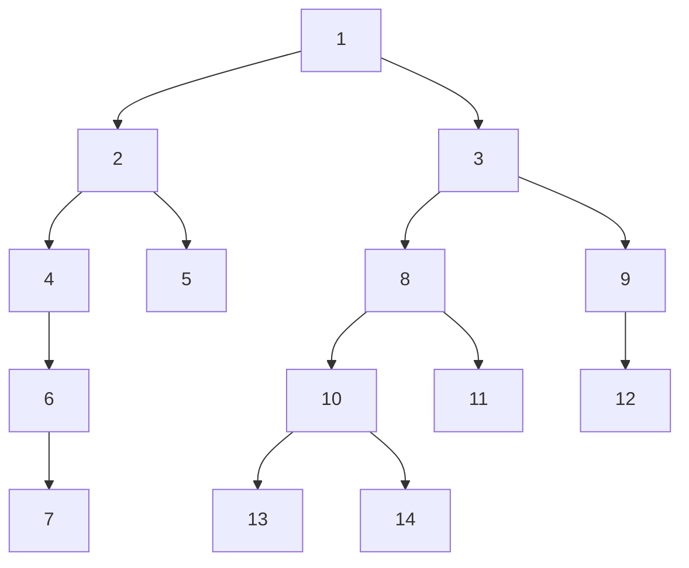
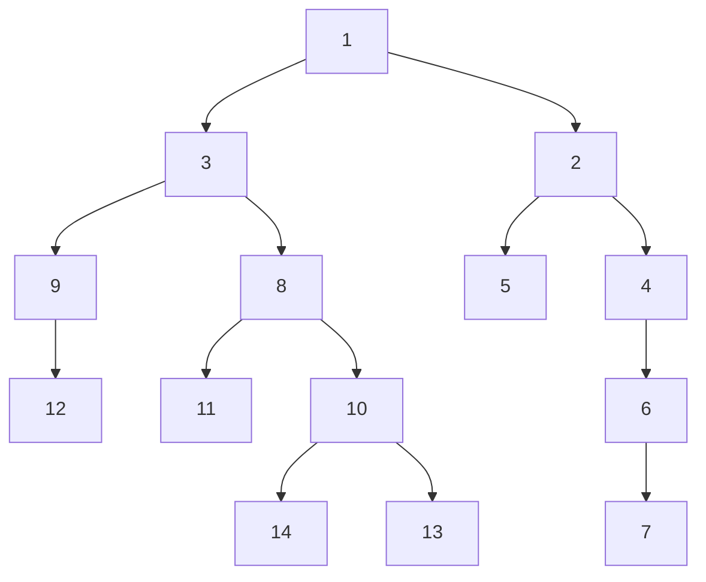

up::[[arbre binaire]]
#informatique/algorithmie #no-review 

---
Opération d'inversion d'un [[arbre binaire]].

L'inverse d'un [[arbre binaire]] est un autre arbre qui est obtenu en inversant la droite et la gauche de l'arbre original.

## Exemple
Soit cet arbre binaire :

Voici son inverse :

