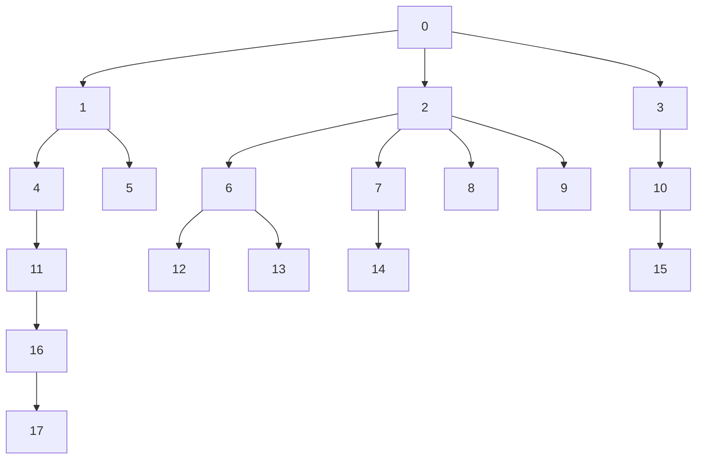

up::[[structure de donnés]], [[graphe]]
#maths #informatique/algorithmie 
# arbre
Un arbre est une [[structure de données]]

## Définition récursive
Un arbre est défini comme une valeur, et une liste de sous-arbres.
On appelle ce couple (valeur, liste de sous arbre) un **noeud**
On considère généralement aussi l'arbre _nul_ (qui ne possède aucun noeuds) comme un arbre également.

### Détails d'implémentation
Pour une implémentation, on considère généralement un arbre comme une valeur et une liste (éventuellement vide) de sous-arbre

## Définition mathématique
### En théorie des graphes
Un _arbre_ un [[graphe]] **acyclique** (qui ne possède aucun [[cycle (théorie des graphes)|cycle]]) et [[connexité (théorie des graphes)|connexe]].

### Avec des relations
Un _arbre_ est la donnée d'un ensemble $E$ et d'une [[relation]] 
[[symétrie d'une relation|symétrique]] $\mathscr R$ sur $E$ telle que deux points distincts quelconques $x$ et $y$ de $E$ soient reliés par un seul chemin injectif fini, c.a.d $n+1$ points $z_0,\ldots,z_n$ de $E$ vérifiant $z_0 = x$, $\forall i<n, z_i \mathscr R z_{i+1}$ et $z_n = y$.

## Propriétés
- **racine** : la racine d'un arbre est le noeud que l'on définit comme celui de "départ".
    - Dans la définition récursive, c'est celui qui contient tous les sous-arbres
- **hauteur** : la profondeur maximale d'un arbre
    - Un arbre à un seul noeud à une hauteur de 0
    - Un arbre _nul_ à une hauteur de -1
- **profondeur** : la profondeur d'un noeud est la longueur du chemin le plus court qui le mène à la **racine** de l'arbre
- **degré** d'un noeud : le nombre d'enfants de ce noeud

## Exemple

Dans cet arbre :
 - ` 0 ` est la **racine**
 - ` 4 ` et ` 5 ` sont les **enfants** de ` 1 `
 - ` 2 ` est un noeud de **degré** 4
 - ` 12 ` à une **profondeur** de 3
 
L'arbre à une **hauteur** de 5

