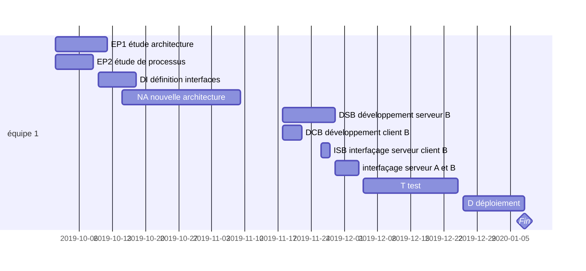
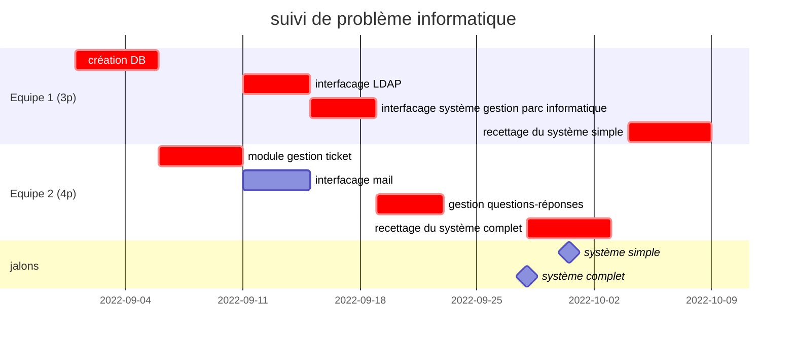

up::[[gantt diagram]]
#exercice 

----

```mermaid
gantt 
    section équipe 1
        EP1 étude architecture: 2019-10-01, 11d
        EP2 étude de processus: 2019-10-01, 8d
        DI définition interfaces: 2019-10-10, 8d
        NA nouvelle architecture: 2019-10-15, 25d
        DSB développement serveur B: 2019-11-18, 11d
        DCB développement client B: 2019-11-18, 4d
        ISB interfaçage serveur client B: 2019-11-26, 2d
        interfaçage serveur A et B: 2019-11-29, 5d
        T test: 2019-12-05, 20d
        D déploiement: 2019-12-26, 13d
        Fin: milestone, 2020-01-08
```

## Exercice 1 : gestion de tickets d'incident

```mermaid
gantt
    title suivi de problème informatique
    dateformat YYYY-M-DD
    section Equipe 1 (3p)
        création DB: crit, 2022-9-01, 5d
        interfacage LDAP: crit, 2022-9-11, 4d
        interfacage système gestion parc informatique: crit, 2022-9-15, 4d
        recettage du système simple: crit, 2022-10-4, 5d
    section Equipe 2 (4p)
        module gestion ticket: crit, 2022-9-06, 5d
        interfacage mail: 2022-9-11, 4d
        gestion questions-réponses: crit, 2022-9-19, 4d
        recettage du système complet: crit, 2022-9-28, 5d
    section jalons
        système simple: milestone, 2022-9-28
        système complet: milestone, 2022-9-2
```
