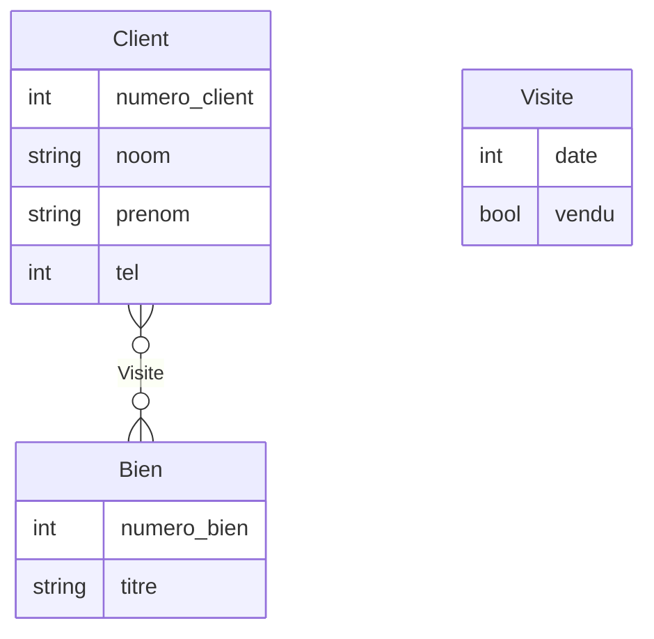

# Diagrames mermaid

```mermaid
erDiagram

Client }o--o{ Bien : Visite
Client {
    int numero_client
    string noom
    string prenom
    int tel
}

Visite {
    int date
    bool vendu
}

Bien {
    int numero_bien
    string titre
}

```

